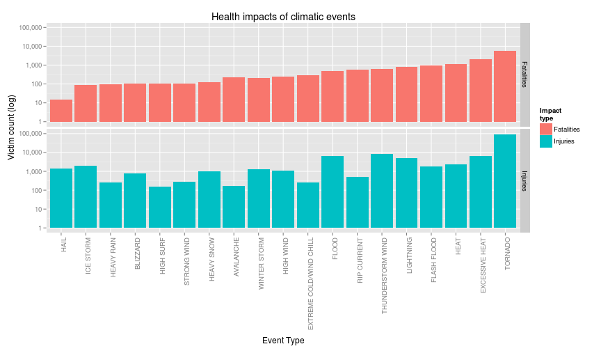
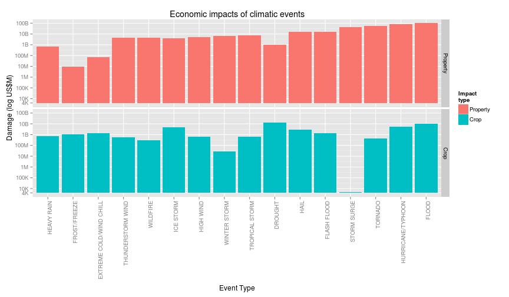

Severity Analysis of Climatic Events in the USA (1950-2011)
========================================================

## Synopsis

This study analyses data from the National Oceanic and Atmospheric Administration to evaluate the impacts of climatic events on human life and property. Data was taken from 1950 to 2011, formatted for consistent analysis and evaluated for the most impactful events. Impact severy was evaluated based on fatalities and injuries, with a cutoff of event types representing 90% of total reported numbers on either variable. A similar approach was made for economic impact, based on property and crop damage variables. Some processing of event types was done, in order to unify different spellings (abbreviations, plural forms, etc.) of the same weather event type. The resulting analysis shows that a small number of weather events are generally the most impactful for both population health and economy.

## Introduction

This report uses the [NOAA Storm Database](https://d396qusza40orc.cloudfront.net/repdata%2Fdata%2FStormData.csv.bz2) to analyse severe weather events, concluding:

1. Across the United States, which types of events (as indicated in the `EVTYPE` variable) are most harmful with respect to population health?

2. Across the United States, which types of events have the greatest economic consequences?

In order to answer those questions, several steps were taken, as illustrated in the following sections:

1. The data was loaded from a compacted csv file
2. The data was formatted as required in order to be usable for the analysis
3. A Pareto of the events was made, concluding that a small number of event
types generate the most impacts.

## Data Processing

### Loading the data
The data is presented as a single CSV, compacted into a bzip format, which can be directly read
throught the `read.csv` command into a dataframe.

```r
stormData = read.csv("Data/StormData.csv.bz2", stringsAsFactors=FALSE)
```

The resulting dataframe has the following structure:

```r
options(digits=4, scipen=100)
print(str(stormData))
```

```
## 'data.frame':	902297 obs. of  37 variables:
##  $ STATE__   : num  1 1 1 1 1 1 1 1 1 1 ...
##  $ BGN_DATE  : chr  "4/18/1950 0:00:00" "4/18/1950 0:00:00" "2/20/1951 0:00:00" "6/8/1951 0:00:00" ...
##  $ BGN_TIME  : chr  "0130" "0145" "1600" "0900" ...
##  $ TIME_ZONE : chr  "CST" "CST" "CST" "CST" ...
##  $ COUNTY    : num  97 3 57 89 43 77 9 123 125 57 ...
##  $ COUNTYNAME: chr  "MOBILE" "BALDWIN" "FAYETTE" "MADISON" ...
##  $ STATE     : chr  "AL" "AL" "AL" "AL" ...
##  $ EVTYPE    : chr  "TORNADO" "TORNADO" "TORNADO" "TORNADO" ...
##  $ BGN_RANGE : num  0 0 0 0 0 0 0 0 0 0 ...
##  $ BGN_AZI   : chr  "" "" "" "" ...
##  $ BGN_LOCATI: chr  "" "" "" "" ...
##  $ END_DATE  : chr  "" "" "" "" ...
##  $ END_TIME  : chr  "" "" "" "" ...
##  $ COUNTY_END: num  0 0 0 0 0 0 0 0 0 0 ...
##  $ COUNTYENDN: logi  NA NA NA NA NA NA ...
##  $ END_RANGE : num  0 0 0 0 0 0 0 0 0 0 ...
##  $ END_AZI   : chr  "" "" "" "" ...
##  $ END_LOCATI: chr  "" "" "" "" ...
##  $ LENGTH    : num  14 2 0.1 0 0 1.5 1.5 0 3.3 2.3 ...
##  $ WIDTH     : num  100 150 123 100 150 177 33 33 100 100 ...
##  $ F         : int  3 2 2 2 2 2 2 1 3 3 ...
##  $ MAG       : num  0 0 0 0 0 0 0 0 0 0 ...
##  $ FATALITIES: num  0 0 0 0 0 0 0 0 1 0 ...
##  $ INJURIES  : num  15 0 2 2 2 6 1 0 14 0 ...
##  $ PROPDMG   : num  25 2.5 25 2.5 2.5 2.5 2.5 2.5 25 25 ...
##  $ PROPDMGEXP: chr  "K" "K" "K" "K" ...
##  $ CROPDMG   : num  0 0 0 0 0 0 0 0 0 0 ...
##  $ CROPDMGEXP: chr  "" "" "" "" ...
##  $ WFO       : chr  "" "" "" "" ...
##  $ STATEOFFIC: chr  "" "" "" "" ...
##  $ ZONENAMES : chr  "" "" "" "" ...
##  $ LATITUDE  : num  3040 3042 3340 3458 3412 ...
##  $ LONGITUDE : num  8812 8755 8742 8626 8642 ...
##  $ LATITUDE_E: num  3051 0 0 0 0 ...
##  $ LONGITUDE_: num  8806 0 0 0 0 ...
##  $ REMARKS   : chr  "" "" "" "" ...
##  $ REFNUM    : num  1 2 3 4 5 6 7 8 9 10 ...
## NULL
```

### Formatting the data
First, we need to generate a usable and consistent exponent to damage property
(PROPDMGEXP and CROPDMGEXP). A quick analysis of the exponent values shows some
processing is required:

```r
unique(c(stormData$PROPDMGEXP, stormData$CROPDMGEXP))
```

```
##  [1] "K" "M" ""  "B" "m" "+" "0" "5" "6" "?" "4" "2" "3" "h" "7" "H" "-"
## [18] "1" "8" "k"
```

It is clear that some translation will be required for usage in calculations.
Besides the H, K, M and B values, which are explained in the documentation for
the dataset, several other unexpected values appear. "", -, ? and + have been
all considered to be 0:

```r
stormData$DMGEXP2[stormData$PROPDMGEXP %in% c("", "-", "?", "+", "0")]=0
stormData$DMGEXP2[stormData$PROPDMGEXP == "1"]=1
stormData$DMGEXP2[stormData$PROPDMGEXP %in% c("h", "H", "2")]=2
stormData$DMGEXP2[stormData$PROPDMGEXP %in% c("3", "K")]=3
stormData$DMGEXP2[stormData$PROPDMGEXP == "4"]=4
stormData$DMGEXP2[stormData$PROPDMGEXP == "5"]=5
stormData$DMGEXP2[stormData$PROPDMGEXP %in% c("M", "m", "6")]=6
stormData$DMGEXP2[stormData$PROPDMGEXP == "7"]=7
stormData$DMGEXP2[stormData$PROPDMGEXP == "8"]=8
stormData$DMGEXP2[stormData$PROPDMGEXP == "B"]=9
stormData$CDMGEXP2[stormData$CROPDMGEXP %in% c("", "?", "0")]=0
stormData$CDMGEXP2[stormData$CROPDMGEXP %in% c("M", "m")]=6
stormData$CDMGEXP2[stormData$CROPDMGEXP %in% c("K", "k")]=3
stormData$CDMGEXP2[stormData$CROPDMGEXP == "B"]=9
stormData$CDMGEXP2[stormData$CROPDMGEXP == "2"]=2
```

### Choosing relevant events
Still, the resulting list has 985 event types, many of them
having little or no impact. In order to focus on the most relevant ones, we will evaluate and
prioritize them based on their impact.

#### Health impacts
To find the most relevant events, we'll take the following steps:
- Event types will be ordered in descending order by the % of total impact they generate on the entire database;
- Fatalities and injury events will be treated independently and grouped on a 
single data frame for health impacts. The events which generate 90% of impact on
either of these will be considered;

```r
require(plyr)
```

```
## Loading required package: plyr
```

```r
quantifEvs = data.frame(event=stormData$EVTYPE, fatalities=stormData$FATALITIES,
               injuries=stormData$INJURIES, 
               propDmg = stormData$PROPDMG*10^stormData$DMGEXP2,
               cropDmg= stormData$CROPDMG*10^stormData$CDMGEXP2)
quantifEvs$event=as.character(quantifEvs$event)
sumEvs=ddply(quantifEvs, "event", summarize, 
        sumFatal=sum(fatalities), cntFatal=sum(fatalities>0), 
        sumInj=sum(injuries), cntInj=sum(injuries>0),
        sumPropDmg = sum(propDmg), cntPropDmg=sum(propDmg>0),
        sumCropDmg = sum(cropDmg), cntCropDmg=sum(cropDmg>0))
totFatal = sum(sumEvs$sumFatal)
totInj = sum(sumEvs$sumInj)
topFatal = order(sumEvs$sumFatal, decreasing=TRUE)
topInj = order(sumEvs$sumInj, decreasing=TRUE)
fatalCutoff = sumEvs$event[topFatal[1:22]]
injCutoff = sumEvs$event[topInj[1:11]]
healthImpEvs = subset(stormData, EVTYPE %in% fatalCutoff | EVTYPE %in% injCutoff)
```

With the variables above, it can be easily show that:
- the top **22** event types with fatalities generate **90.5%** of fatalities.
- the top **11** event types with injuries generate **90.3%** of injuries.

### Economic impacts
A similar approach will yield the most relevant events related to economic impacts:
- Event types will be ordered in descending order by the % of total impact they generate on the entire database;
- Property and crop damage will be treated independently and grouped on a single
dataframe for economic impact. The events which generate 90% of impact on either
of these will be considered.

```r
totPropDmg = sum(sumEvs$sumPropDmg)
totCropDmg = sum(sumEvs$sumCropDmg)
topPropDmg = order(sumEvs$sumPropDmg, decreasing=TRUE)
topCropDmg = order(sumEvs$sumCropDmg, decreasing=TRUE)
propDmgCutoff = sumEvs$event[topPropDmg[1:12]]
cropDmgCutoff = sumEvs$event[topCropDmg[1:14]]
econImpEvs = subset(stormData, EVTYPE %in% propDmgCutoff | EVTYPE %in% cropDmgCutoff)
```

The variables calculated above allow us to see that:
- the top **12** event types with property damage generate **90.7%** of losses.
- the top **14** event types with crop damage generate **90.6%** of losses.

- After the previous steps, we conclude that the relevant event types are the
following:
AVALANCHE, BLIZZARD, DROUGHT, EXCESSIVE HEAT, EXTREME COLD, EXTREME COLD/WIND CHILL, EXTREME HEAT, FLASH FLOOD, FLOOD, FROST/FREEZE, HAIL, HEAT, HEAT WAVE, HEAVY RAIN, HEAVY SNOW, HIGH SURF, HIGH WIND, HURRICANE, HURRICANE/TYPHOON, ICE STORM, LIGHTNING, RIP CURRENT, RIP CURRENTS, RIVER FLOOD, STORM SURGE, STRONG WIND, THUNDERSTORM WIND, TORNADO, TROPICAL STORM, TSTM WIND, WILDFIRE, WINTER STORM

The list of relevant events clearly has some quality problems, namely different spellings for the same event type. The following corrections are needed:
- Replace "EXTREME COLD" with "EXTREME COLD/WIND CHILL"
- Replace "EXTREME HEAT" with "EXCESSIVE HEAT"
- Replace "HEAT WAVE" with "HEAT"
- Replace "HURRICANE" with "HURRICANE/TYPHOON"
- Replace "RIVER FLOOD" with "FLOOD"
- Replace "RIP CURRENTS" with "RIP CURRENT"
- Replace "TSTM WIND" with "THUNDERSTORM WIND"

```r
econImpEvs$EVTYPE[econImpEvs$EVTYPE == "EXTREME COLD"] = "EXTREME COLD/WIND CHILL"
econImpEvs$EVTYPE[econImpEvs$EVTYPE == "EXTREME HEAT"] = "EXCESSIVE HEAT"
econImpEvs$EVTYPE[econImpEvs$EVTYPE == "RIVER FLOOD"] = "FLOOD"
econImpEvs$EVTYPE[econImpEvs$EVTYPE == "HEAT WAVE"] = "HEAT"
econImpEvs$EVTYPE[econImpEvs$EVTYPE == "HURRICANE"] = "HURRICANE/TYPHOON"
econImpEvs$EVTYPE[econImpEvs$EVTYPE == "RIP CURRENTS"] = "RIP CURRENT"
econImpEvs$EVTYPE[econImpEvs$EVTYPE == "TSTM WIND"] = "THUNDERSTORM WIND"

healthImpEvs$EVTYPE[healthImpEvs$EVTYPE == "EXTREME COLD"] = "EXTREME COLD/WIND CHILL"
healthImpEvs$EVTYPE[healthImpEvs$EVTYPE == "EXTREME HEAT"] = "EXCESSIVE HEAT"
healthImpEvs$EVTYPE[healthImpEvs$EVTYPE == "RIVER FLOOD"] = "FLOOD"
healthImpEvs$EVTYPE[healthImpEvs$EVTYPE == "HEAT WAVE"] = "HEAT"
healthImpEvs$EVTYPE[healthImpEvs$EVTYPE == "HURRICANE"] = "HURRICANE/TYPHOON"
healthImpEvs$EVTYPE[healthImpEvs$EVTYPE == "RIP CURRENTS"] = "RIP CURRENT"
healthImpEvs$EVTYPE[healthImpEvs$EVTYPE == "TSTM WIND"] = "THUNDERSTORM WIND"
```

- After fixing the names, we are left with the following list of relevant events
(relevant being defined as being in the events that cause the top 90% of impacts):
AVALANCHE, BLIZZARD, DROUGHT, EXCESSIVE HEAT, EXTREME COLD/WIND CHILL, FLASH FLOOD, FLOOD, FROST/FREEZE, HAIL, HEAT, HEAVY RAIN, HEAVY SNOW, HIGH SURF, HIGH WIND, HURRICANE/TYPHOON, ICE STORM, LIGHTNING, RIP CURRENT, STORM SURGE, STRONG WIND, THUNDERSTORM WIND, TORNADO, TROPICAL STORM, WILDFIRE, WINTER STORM

## Results

### Health impacts
In order to plot the data, it first has to be formatted in a way that will allow
us to plot it adequately.

```r
quantifEvs = data.frame(event=healthImpEvs$EVTYPE, fatalities=healthImpEvs$FATALITIES,
               injuries=healthImpEvs$INJURIES)
quantifEvs$event=as.character(quantifEvs$event)
sumEvs=ddply(quantifEvs, "event", summarize, 
        sumFatal=sum(fatalities), cntFatal=sum(fatalities>0), 
        sumInj=sum(injuries), cntInj=sum(injuries>0))
y = rbind(data.frame(event=sumEvs$event, statType="Fatalities", statVal = sumEvs$sumFatal),
          data.frame(event=sumEvs$event, statType="Injuries", statVal = sumEvs$sumInj))
```

The following plot shows the victim counts for the event types that account for 
at least 90% of health impacts due to climatic events. Due to the large variation 
of counts between different events, a logaritmic scale was used.

```r
require(ggplot2)
```

```
## Loading required package: ggplot2
```

```r
require(scales)
```

```
## Loading required package: scales
```

```r
ggplot(data=y, aes(x=reorder(event, statVal, min), y=statVal, fill=statType)) +
    facet_grid(statType~.) +
    geom_bar(stat="identity", position="dodge") +
    theme(axis.text.x = element_text(angle = 90, hjust=1)) +
    labs(x="Event Type", y="Victim count (log)") +
    scale_y_log10(breaks=10^seq.int(0, 5, 1), labels=comma, limits=c(1, 100000)) +
    scale_fill_discrete(name="Impact\ntype") +
    ggtitle("Health impacts of climatic events")
```

 

The graph shows that only **19** event types 
cause **13811** fatalities and **131933** injuries.

### Economic impacts
The following plot shows the victim counts for the event types that account for 
at least 90% of economic impacts due to climatic events. Due to the large disparity 
of counts between different events, a logaritmic scale was used. The commands 
before the plot format the data so that it can be properly plotted.

```r
quantifEvs2 = data.frame(event=econImpEvs$EVTYPE,
                        propDmg=econImpEvs$PROPDMG*10^econImpEvs$DMGEXP2,
                        cropDmg=econImpEvs$CROPDMG*10^econImpEvs$CDMGEXP2)
quantifEvs2$event=as.character(quantifEvs2$event)
sumEvs2=ddply(quantifEvs2, "event", summarize, 
        sumPropDmg=sum(propDmg), cntpropDmg=sum(propDmg>0), 
        sumCropDmg=sum(cropDmg), cntCropDmg=sum(cropDmg>0))
y = rbind(data.frame(event=sumEvs2$event, statType="Property", statVal = sumEvs2$sumPropDmg),
          data.frame(event=sumEvs2$event, statType="Crop", statVal = sumEvs2$sumCropDmg))
ggplot(data=y, aes(x=reorder(event, statVal, max), y=statVal, fill=statType)) +
    facet_grid(statType~.) +
    geom_bar(stat="identity", position="dodge") +
    theme(axis.text.x = element_text(angle = 90, hjust=1)) +
    labs(x="Event Type", y="Damage (log US$M)")+
    scale_y_log10(breaks=c(4000, 10^seq.int(4, 11, 1)), 
                  labels=c("4K", "10K", "100K", "1M", "10M", "100M",
                           "1B", "10B", "100B"),
                  limits=c(4000, 10^11), oob=squish) +
    scale_fill_discrete(name="Impact\ntype") +
    ggtitle("Economic impacts of climatic events")
```

 

The graph shows that only **19** event types 
cause **US$398,454,648,426** in property damage and **US$45,211,919,843** in crop losses.

### Final Conclusions
The previous graphs clearly define the most impactful weather events for the variables considered. The following table quantifies the health impacts in terms of fatalities and injuries:

```r
require(xtable)
```

```
## Loading required package: xtable
```

```r
xt = xtable(arrange(sumEvs[c(1,2,4)], -sumFatal, sumInj), 
            caption="Major Weather Events: Health Impacts",
            display=c("d", "s", "d", "d"))
colnames(xt) <- c("Event", "Fatalities", "Injuries")
print(xt, type="html")
```

<!-- html table generated in R 3.1.0 by xtable 1.7-3 package -->
<!-- Sun Jun 22 13:23:47 2014 -->
<TABLE border=1>
<CAPTION ALIGN="bottom"> Major Weather Events: Health Impacts </CAPTION>
<TR> <TH>  </TH> <TH> Event </TH> <TH> Fatalities </TH> <TH> Injuries </TH>  </TR>
  <TR> <TD align="right"> 1 </TD> <TD> TORNADO </TD> <TD align="right"> 5633 </TD> <TD align="right"> 91346 </TD> </TR>
  <TR> <TD align="right"> 2 </TD> <TD> EXCESSIVE HEAT </TD> <TD align="right"> 1999 </TD> <TD align="right"> 6680 </TD> </TR>
  <TR> <TD align="right"> 3 </TD> <TD> HEAT </TD> <TD align="right"> 1109 </TD> <TD align="right"> 2409 </TD> </TR>
  <TR> <TD align="right"> 4 </TD> <TD> FLASH FLOOD </TD> <TD align="right"> 978 </TD> <TD align="right"> 1777 </TD> </TR>
  <TR> <TD align="right"> 5 </TD> <TD> LIGHTNING </TD> <TD align="right"> 816 </TD> <TD align="right"> 5230 </TD> </TR>
  <TR> <TD align="right"> 6 </TD> <TD> THUNDERSTORM WIND </TD> <TD align="right"> 637 </TD> <TD align="right"> 8445 </TD> </TR>
  <TR> <TD align="right"> 7 </TD> <TD> RIP CURRENT </TD> <TD align="right"> 572 </TD> <TD align="right"> 529 </TD> </TR>
  <TR> <TD align="right"> 8 </TD> <TD> FLOOD </TD> <TD align="right"> 470 </TD> <TD align="right"> 6789 </TD> </TR>
  <TR> <TD align="right"> 9 </TD> <TD> EXTREME COLD/WIND CHILL </TD> <TD align="right"> 285 </TD> <TD align="right"> 255 </TD> </TR>
  <TR> <TD align="right"> 10 </TD> <TD> HIGH WIND </TD> <TD align="right"> 248 </TD> <TD align="right"> 1137 </TD> </TR>
  <TR> <TD align="right"> 11 </TD> <TD> AVALANCHE </TD> <TD align="right"> 224 </TD> <TD align="right"> 170 </TD> </TR>
  <TR> <TD align="right"> 12 </TD> <TD> WINTER STORM </TD> <TD align="right"> 206 </TD> <TD align="right"> 1321 </TD> </TR>
  <TR> <TD align="right"> 13 </TD> <TD> HEAVY SNOW </TD> <TD align="right"> 127 </TD> <TD align="right"> 1021 </TD> </TR>
  <TR> <TD align="right"> 14 </TD> <TD> STRONG WIND </TD> <TD align="right"> 103 </TD> <TD align="right"> 280 </TD> </TR>
  <TR> <TD align="right"> 15 </TD> <TD> HIGH SURF </TD> <TD align="right"> 101 </TD> <TD align="right"> 152 </TD> </TR>
  <TR> <TD align="right"> 16 </TD> <TD> BLIZZARD </TD> <TD align="right"> 101 </TD> <TD align="right"> 805 </TD> </TR>
  <TR> <TD align="right"> 17 </TD> <TD> HEAVY RAIN </TD> <TD align="right">  98 </TD> <TD align="right"> 251 </TD> </TR>
  <TR> <TD align="right"> 18 </TD> <TD> ICE STORM </TD> <TD align="right">  89 </TD> <TD align="right"> 1975 </TD> </TR>
  <TR> <TD align="right"> 19 </TD> <TD> HAIL </TD> <TD align="right">  15 </TD> <TD align="right"> 1361 </TD> </TR>
   </TABLE>

The following table quantifies the economic impacts in terms of property damage
and crop losses:

```r
xt = xtable(arrange(sumEvs2[c(1,2,4)], -sumPropDmg, sumCropDmg), 
            caption="Major Weather Events: Economic Impacts",
            display=c("d", "s", "f", "f"))
colnames(xt) <- c("Event", "Prop Dmg (US$K)", "Crop Dmg (US$K)")
xt[,2] = xt[,2]/1000
xt[,3] = xt[,3]/1000
print(xt, type="html")
```

<!-- html table generated in R 3.1.0 by xtable 1.7-3 package -->
<!-- Sun Jun 22 13:23:47 2014 -->
<TABLE border=1>
<CAPTION ALIGN="bottom"> Major Weather Events: Economic Impacts </CAPTION>
<TR> <TH>  </TH> <TH> Event </TH> <TH> Prop Dmg (US$K) </TH> <TH> Crop Dmg (US$K) </TH>  </TR>
  <TR> <TD align="right"> 1 </TD> <TD> FLOOD </TD> <TD align="right"> 149776655.31 </TD> <TD align="right"> 10691427.45 </TD> </TR>
  <TR> <TD align="right"> 2 </TD> <TD> HURRICANE/TYPHOON </TD> <TD align="right"> 81174159.01 </TD> <TD align="right"> 5349782.80 </TD> </TR>
  <TR> <TD align="right"> 3 </TD> <TD> TORNADO </TD> <TD align="right"> 56947380.68 </TD> <TD align="right"> 414953.27 </TD> </TR>
  <TR> <TD align="right"> 4 </TD> <TD> STORM SURGE </TD> <TD align="right"> 43323536.00 </TD> <TD align="right"> 5.00 </TD> </TR>
  <TR> <TD align="right"> 5 </TD> <TD> FLASH FLOOD </TD> <TD align="right"> 16822673.98 </TD> <TD align="right"> 1421317.10 </TD> </TR>
  <TR> <TD align="right"> 6 </TD> <TD> HAIL </TD> <TD align="right"> 15735267.51 </TD> <TD align="right"> 3025954.47 </TD> </TR>
  <TR> <TD align="right"> 7 </TD> <TD> TROPICAL STORM </TD> <TD align="right"> 7703890.55 </TD> <TD align="right"> 678346.00 </TD> </TR>
  <TR> <TD align="right"> 8 </TD> <TD> WINTER STORM </TD> <TD align="right"> 6688497.25 </TD> <TD align="right"> 26944.00 </TD> </TR>
  <TR> <TD align="right"> 9 </TD> <TD> HIGH WIND </TD> <TD align="right"> 5270046.29 </TD> <TD align="right"> 638571.30 </TD> </TR>
  <TR> <TD align="right"> 10 </TD> <TD> WILDFIRE </TD> <TD align="right"> 4765114.00 </TD> <TD align="right"> 295472.80 </TD> </TR>
  <TR> <TD align="right"> 11 </TD> <TD> THUNDERSTORM WIND </TD> <TD align="right"> 4484928.50 </TD> <TD align="right"> 554007.35 </TD> </TR>
  <TR> <TD align="right"> 12 </TD> <TD> ICE STORM </TD> <TD align="right"> 3944927.86 </TD> <TD align="right"> 5022113.50 </TD> </TR>
  <TR> <TD align="right"> 13 </TD> <TD> DROUGHT </TD> <TD align="right"> 1046106.00 </TD> <TD align="right"> 13972566.00 </TD> </TR>
  <TR> <TD align="right"> 14 </TD> <TD> HEAVY RAIN </TD> <TD align="right"> 694248.09 </TD> <TD align="right"> 733399.80 </TD> </TR>
  <TR> <TD align="right"> 15 </TD> <TD> EXTREME COLD/WIND CHILL </TD> <TD align="right"> 67737.40 </TD> <TD align="right"> 1292973.00 </TD> </TR>
  <TR> <TD align="right"> 16 </TD> <TD> FROST/FREEZE </TD> <TD align="right"> 9480.00 </TD> <TD align="right"> 1094086.00 </TD> </TR>
   </TABLE>

Still, this analysis considered events to be consistent and evenly distributed data across
the entire **61 year** period evaluated. Measurement technology and sensor distribution
have changed through this period. Also, governments have taken measures to reduce impacts
that change what events are most relevant at the beginning and end of periods,
and further analysis of changes in event severity over time are recommended.

It should also be considered that events have different distribution and impacts
over the country, and specific states and counties should rebuild this analysis
using a filter for their regions of interest.
